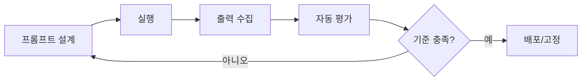

## 한눈 요약

- 프롬프트는 모델에게 주는 사양서다. 역할(Role)·목표(Goal)·형식(Format)을 첫 단락에서 고정하라.  
- 모호어(짧게, 대충, 적당히) 대신 수량·길이·스키마로 수치화하라.  
- 제로샷 → 퓨샷(예시 1–3) → 파인튜닝의 단계로 정밀도를 높여라.  
- 출력은 기계가 읽기 쉬운 JSON/표/키 구성을 우선시하라.  
- 품질은 자동 평가(루브릭/테스트)로 관리하라. 사람 검토는 마지막 단계[^human-in-the-loop].

---

## 목차

- [핵심 원칙](#핵심-원칙)
- [실전 패턴 & 템플릿](#실전-패턴--템플릿)
- [안티패턴(나쁜 습관)과 개선 예시](#안티패턴나쁜-습관과-개선-예시)
- [자동 평가 루브릭](#자동-평가-루브릭)
- [실험 프로토콜(재현 가능한 워크플로우)](#실험-프로토콜재현-가능한-워크플로우)
- [데이터셋/스키마 권장 형식](#데이터셋스키마-권장-형식)
- [안전·윤리 체크리스트](#안전윤리-체크리스트)
- [국제화(I18N) 전략](#국제화i18n-전략)
- [문제 해결 가이드](#문제-해결-가이드)
- [부록: 도구/레퍼런스](#부록-도구레퍼런스)

---

## 핵심 원칙

| 원칙 | 설명 | 미니 예시 |
|:--|:--|:--|
| 역할 우선 | 모델이 “누구인지”를 지정하면 톤/지식/관점이 정렬됨 | “당신은 B2C 카피라이터입니다.” |
| 목표 명시 | 산출물의 목적과 성공기준을 한 문장으로 | “장바구니 이탈률을 낮출 3개의 CTA.” |
| 형식 고정 | JSON/표/불릿 등 기계친화 형식 고정 | “{title, cta, reason} 배열로만 출력.” |
| 수치화 | 길이·개수·제약을 정량화 | “각 12–18자, 총 3개.” |
| 예시 최소 | 1–3개의 고품질 예시로 패턴 고정 | 입력/출력 페어 제공 |
| 질문 유도 | 정보 부족 시 질문 1개씩 | “부족하면 한 번에 1문항만 질의.” |
| 안전 가드 | 금지·민감 정보·출처 정책 명시 | “출처 없는 수치 금지.” |

> 참고: “하지 말라”보다 “이렇게 하라”가 더 잘 작동한다. 부정 지시 대신 긍정 지시를 사용하라.

---

## 실전 패턴 & 템플릿

### 범용 블루프린트

```text
역할: 당신은 [역할]입니다.
목표: [최종 산출물 1문장].
형식: [JSON|표|불릿], 길이 [숫자], 톤 [대상/스타일].
제약: [금지/출처/정확도/정렬 기준].
컨텍스트: """
[배경·데이터·조건]
"""
부족 정보가 있으면 질문 1개만 하고, 응답을 받은 뒤 진행하세요.
출력은 [형식]만 반환하세요. 다른 설명 금지.
```

### 요약(Extractive/Abstractive)

```text
작업: 아래 보고서의 핵심 요점 5개(각 18–24자)와 리스크 3개를 추출.
형식(JSON만): {"points":[...5], "risks":[...3]}
텍스트: """[원문]"""
```

### 정보 추출(JSON 스키마 고정)

```text
작업: 아래 기사에서 회사명, 인물, 날짜, 금액을 추출.
형식(JSON Schema):
{
  "companies": "string[]",
  "people": "string[]",
  "dates": "string[]",     // ISO 형식 권장
  "amounts": "string[]"    // 통화기호 포함 그대로
}
텍스트: """[원문]"""
```

### 코드 생성(테스트 지향)

```text
역할: 시니어 TypeScript 엔지니어.
목표: 이메일 유효성 검사 함수 + 테스트 3개.
형식: 하나의 코드 블록. 실행 단계 3줄 포함.
제약: 타입 안전, 엣지케이스(빈문자열, 공백, TLD 1자) 포함.
```

```typescript
export const isEmail = (s: string): boolean => /^[^\s@]+@[^\s@]+\.[^\s@]+$/.test(s);

// tests (vitest)
import { expect, test } from "vitest";
test("valid", () => expect(isEmail("a@b.co")).toBe(true));
test("empty", () => expect(isEmail("")).toBe(false));
test("space", () => expect(isEmail(" a@b.co")).toBe(false));
```

### 번역/리라이트(보존 규칙)

```text
작업: 아래 문단을 한국어 존댓말로 번역하되, 고유명사와 숫자는 보존.
길이: 원문 ±10%.
톤: 명확·간결.
원문: """[text]"""
```

### 체인-오브-명세(CoT 경량)

```text
작업: 최종 답만 출력하되, 첫 줄에 가정 3가지, 둘째 줄에 근거 3줄 요약.
형식:
- Assumptions: A1; A2; A3
- Rationale: R1 / R2 / R3
- Answer: <최종 결과>
```

---

## 안티패턴(나쁜 습관)과 개선 예시

1) 모호어 남발  
- 나쁨: “짧게 요약해줘.”  
- 개선: “핵심 5개 불릿, 각 14–18자.”

2) 형식 미지정  
- 나쁨: “엔티티 추출해줘.”  
- 개선: JSON 스키마 고정 + 키 순서 지정.

3) 금지 위주 지시  
- 나쁨: “반복하지 말고, 질문하지 마.”  
- 개선: “정보 부족 시 1문항 질의 후 진행.”

4) 인라인 데이터 뒤섞기  
- 나쁨: 지시/데이터 혼합.  
- 개선: 데이터는 """ 블록으로 분리.

---

## 자동 평가 루브릭

### 체크리스트(가중치 포함)

| 항목 | 설명 | 가중치 | 기준 |
|:--|:--|:--:|:--|
| 형식 일치 | JSON/표 등 스키마 정확도 | 0.3 | 키 누락 0, 순서 무관 |
| 정확성 | 사실/숫자/링크 정확 | 0.3 | 출처 미기재 시 감점 |
| 완전성 | 요구 개수/길이 충족 | 0.2 | ±10% 허용 |
| 스타일 | 톤/대상 적합 | 0.1 | 가독성, 문장 종결 |
| 안전 | 금지 항목 위반 여부 | 0.1 | 1회 위반 시 0점 |

### JSON 기반 미니 평가기

```json
{
  "task_id": "pe-001",
  "rubric": [
    {"name":"format","weight":0.3,"rule":"valid_json_schema"},
    {"name":"accuracy","weight":0.3,"rule":"factual_no_unjustified_numbers"},
    {"name":"completeness","weight":0.2,"rule":"count_length_bounds"},
    {"name":"style","weight":0.1,"rule":"tone_target_matching"},
    {"name":"safety","weight":0.1,"rule":"no_pii_no_policy_violation"}
  ]
}
```

간이 점수 계산 의사코드:

```python
def score(rubric, checks):
    return round(sum(r["weight"]*checks[r["name"]] for r in rubric), 3)
```

---

## 실험 프로토콜(재현 가능한 워크플로우)

1. 가설 정의: “예시 2개 추가 시 정확성 +8%”  
2. 프롬프트 A/B 준비(버전 관리): `prompts/summary.v1.txt`, `prompts/summary.v2.txt`  
3. 고정 시드/고정 샘플셋 실행  
4. 자동 평가 스크립트로 점수 산출 → 로그 저장  
5. 통계 요약 → 회귀/유의성 검정(선택)

```bash
# 1) 실행
python run_eval.py --prompt prompts/summary.v1.txt --data data/dev.jsonl --out out/v1.jsonl
python run_eval.py --prompt prompts/summary.v2.txt --data data/dev.jsonl --out out/v2.jsonl

# 2) 집계
python score.py --rubric rubric.json --pred out/v1.jsonl --gold data/gold.jsonl > report/v1.md
python score.py --rubric rubric.json --pred out/v2.jsonl --gold data/gold.jsonl > report/v2.md
```

Mermaid로 본 루프:



---

## 데이터셋/스키마 권장 형식

### JSONL(권장)

```json
{"id":"ex1","input":"...원문...","output":{"points":["..."]}}
{"id":"ex2","input":"...원문...","output":{"points":["..."]}}
```

### 스키마 선언(YAML)

```yaml
task: "bullet_summary_5"
input: "string"
output:
  points:
    type: array
    items: {type: string, minLength: 10, maxLength: 24}
```

---

## 안전·윤리 체크리스트

- [ ] 출처 없는 수치·의학/법률 조언 금지  
- [ ] 개인식별정보(PII) 요청/노출 금지  
- [ ] 편향적 표현·차별 언어 회피  
- [ ] 허위 인용/날조 링크 금지  
- [ ] 민감 주제는 중립적 요약 + 출처 제공

> 주의: 안전 규칙은 “금지”만이 아니라 “대안 제시(리다이렉션)”를 포함해야 한다.  
> 예) “계정 비밀번호는 안내할 수 없습니다. 대신 비밀번호 재설정 가이드를 참조하세요: `https://example.com/reset`”.

---

## 국제화(I18N) 전략

- 입력의 언어를 감지하여 출력 언어를 기본 매칭.  
- 날짜/숫자/통화 포맷 지역화(예: `2025-10-08`, `1,234.56`).  
- 번역 지침: 고유명사·숫자·제품명 보존, 관용표현은 의미 등가 번역.  
- 용어집(glossary) JSON을 컨텍스트에 주입해 일관성 유지.

```json
{"login":"로그인","sign up":"가입하기","checkout":"결제하기"}
```

---

## 문제 해결 가이드

- 출력이 산만함 → 형식(JSON/표) 고정 + 예시 1개 추가  
- 길이 과다/부족 → 최소/최대 글자수 또는 문장 수 지정  
- 헛소리 발생 → “모를 경우 ‘정보 부족’으로 표기” 규칙 추가  
- 반복 질문 → “정보 부족 시 질문 1개 후 중단”  
- 코드 오류 → “테스트 3개 포함”, “에러 케이스 2개” 명시

---

## 부록: 도구/레퍼런스

- 링크: [OpenAI 가이드][openai-pe], [GFM 사양][gfm], [Prompting Guide][pg]  
- 예제 저장소: `https://github.com/example/prompt-lab`  
- 라이선스: CC BY 4.0

---

### 예시 프롬프트 카드(참고용)

```text
카드ID: SUMM-5BUL-KO
역할: 기술 문서 에디터
목표: 원문 핵심 5개 불릿(각 14–18자)
형식: {"points":[string*5]}
제약: 추측 금지, 숫자 근거 없는 삽입 금지
텍스트: """[원문]"""
```

---

[^human-in-the-loop]: 자동 평가가 최우선이되, 고난도 과제(윤리·법률·의학)는 반드시 최종 인간 검토 단계를 둔다.

[openai-pe]: `https://help.openai.com/en/articles/6654000-best-practices-for-prompt-engineering-with-the-openai-api`
[gfm]: `https://github.github.com/gfm/`
[pg]: `https://www.promptingguide.ai/`